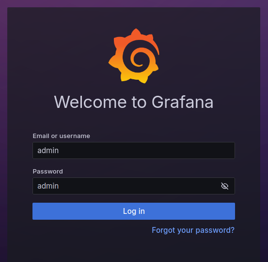
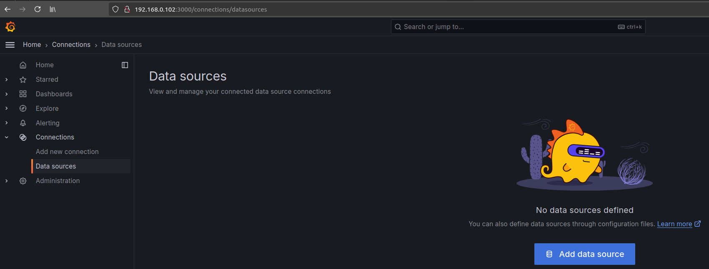
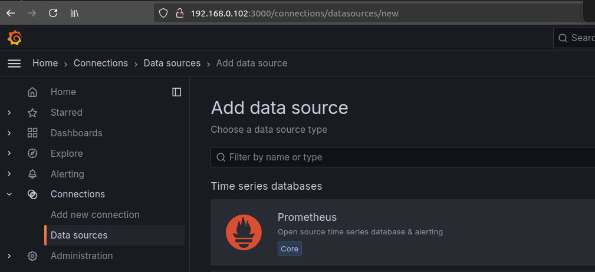
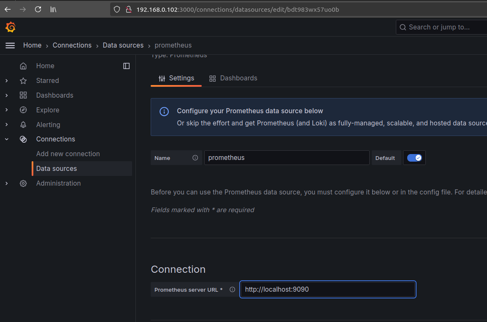
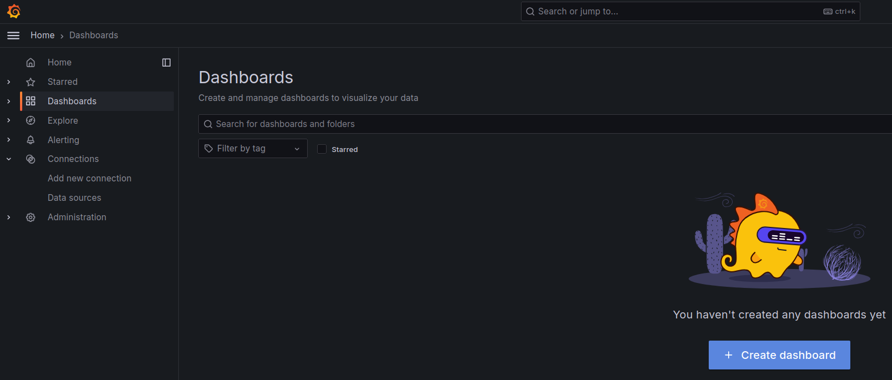
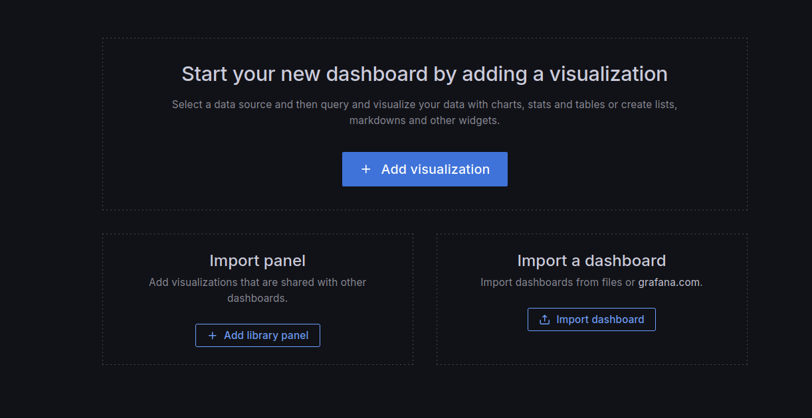
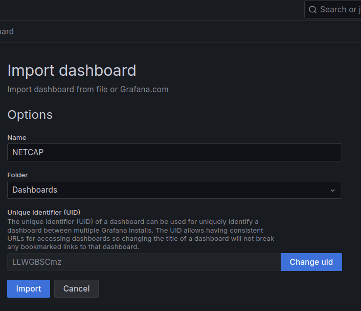
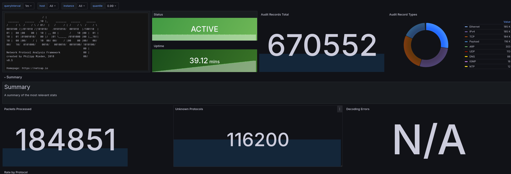
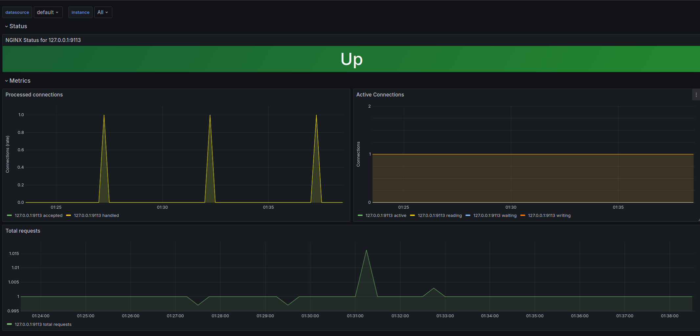

Configuration of Nginx Monitoring 

Requirements:
- Ubuntu 22.04.4 LTS
- kernel - 5.15.0-116-generic
- 1 CPU - 2200 MHz
- Mem - 4096 Mb
- Storage - 20 Gb

#### Install Nginx

```shell
sudo su
```

```shell
apt update && apt upgrade && apt install chrony nginx -y

systemctl stop ufw && systemctl disable ufw

timedatectl set-timezone Europe/Moscow

echo -e "\n\n\n\n\n$(hostname -I)\n" | openssl req -x509 -nodes -days 365 -newkey rsa:2048 -keyout /etc/ssl/private/nginx-selfsigned.key -out /etc/ssl/certs/nginx-selfsigned.crt

openssl dhparam -out /etc/nginx/dhparam.pem 4096

rm -rf /etc/nginx/sites-available/default

tee -a /etc/nginx/sites-available/default << EOF
server {
    listen 443 ssl http2;
    listen [::]:443 ssl;

    include snippets/self-signed.conf;
    include snippets/ssl-params.conf;

    root '/opt/site';

    index index.html;

    server_name 'hack.me';

    location / {
        try_files \$uri \$uri/ =404;
    }
}
EOF

tee -a /etc/nginx/snippets/self-signed.conf << EOF  
ssl_certificate /etc/ssl/certs/nginx-selfsigned.crt;  
ssl_certificate_key /etc/ssl/private/nginx-selfsigned.key;  
EOF

tee -a /etc/nginx/snippets/ssl-params.conf << EOF  
ssl_protocols TLSv1.2;  
ssl_prefer_server_ciphers on;  
ssl_dhparam /etc/nginx/dhparam.pem;  
ssl_ciphers ECDHE-RSA-AES256-GCM-SHA512:DHE-RSA-AES256-GCM-SHA512:ECDHE-RSA-AES256-GCM-SHA384:DHE-RSA-AES256-GCM-SHA384:ECDHE-RSA-AES256-SHA384;  
ssl_ecdh_curve secp384r1; # Requires nginx >= 1.1.0  
ssl_session_timeout  10m;  
ssl_session_cache shared:SSL:10m;  
ssl_session_tickets off; # Requires nginx >= 1.5.9  
ssl_stapling on; # Requires nginx >= 1.3.7  
ssl_stapling_verify on; # Requires nginx => 1.3.7  
resolver 8.8.8.8 8.8.4.4 valid=300s;  
resolver_timeout 5s;  
add_header X-Frame-Options DENY;  
add_header X-Content-Type-Options nosniff;  
add_header X-XSS-Protection "1; mode=block";  
EOF

tee -a /etc/nginx/sites-enabled/metrics << EOF  
server {                                       
listen 127.0.0.1:8080;  
  
server_name _;  
  
location /stub_status {  
    stub_status;  
}  
}  
EOF

mkdir /opt/site

wget https://raw.githubusercontent.com/Millen93/sources/main/index.html -O /opt/site/index.html

systemctl enable nginx  
systemctl restart nginx
```

#### Install nginx-prometheus-exporter
https://github.com/nginxinc/nginx-prometheus-exporter
```shell 
snap install nginx-prometheus-exporter

mkdir /home/nginx_exporter && chown -R nginx_exporter:nginx_exporter /home/nginx_exporter

groupadd --system nginx_exporter  
useradd -s /sbin/nologin --system -g nginx_exporter nginx_exporter

tee -a /etc/systemd/system/nginx_exporter.socket << EOF  
[Unit]  
Description=NGINX Prometheus Exporter  
[Socket]  
ListenStream=127.0.0.1:9113  
[Install]  
WantedBy=sockets.target  
EOF

tee -a /etc/systemd/system/nginx_exporter.service << EOF  
[Unit]  
Description=NGINX Prometheus Exporter  
Requires=nginx_exporter.socket  
[Service]  
User=nginx_exporter  
ExecStart=/snap/bin/nginx-prometheus-exporter --nginx.scrape-uri=http://127.0.0.1:8080/stub_status --web.systemd-socket  
[Install]  
WantedBy=multi-user.target  
EOF

systemctl daemon-reload  
systemctl enable nginx_exporter.socket  
systemctl enable nginx_exporter.service  
systemctl start nginx_exporter.socket  
systemctl start nginx_exporter.service
```

#### Install Zeek 
https://zeek.org/
https://github.com/zeek/zeek

== I recommend use this type of IDS. If u use this skip nectcap part ==
```shell
echo 'deb http://download.opensuse.org/repositories/security:/zeek/xUbuntu_22.04/ /' | tee /etc/apt/sources.list.d/security:zeek.list

curl -fsSL https://download.opensuse.org/repositories/security:zeek/xUbuntu_22.04/Release.key | gpg --dearmor | tee /etc/apt/trusted.gpg.d/security_zeek.gpg > /dev/null

apt update

apt install zeek-6.0

export PATH=/opt/zeek/bin:$PATH PREF=/opt/zeek 

rm -rf $PREF/etc/node.cfg

tee -a $PREF/etc/node.cfg << EOF
[zeek]
type=standalone
host=localhost
interface=$(ip route | grep '^default' |grep -Po '(?<=(dev ))(\S+)')
EOF


# Here you need to poke everywhere with the paw Y, even if the UNIT tests have failed.
zkg install ncsa/bro-simple-scan zeek-notice-telegram

echo "@load packages" >> $PREF/share/zeek/site/local.zeek

sed -i  "s|\&default=0/unknown|\&default=1234/tcp|" /opt/zeek/share/zeek/base/frameworks/cluster/main.zeek

zeekctl install
zeekctl start

tee -a /root/prometheus.yml << EOF  
global:
  scrape_interval:     1s 
  evaluation_interval: 1s 
  scrape_timeout: 1s
  external_labels:
      monitor: 'my-project'
alerting:
  alertmanagers:
  - static_configs:
    - targets:
      - 'localhost:9093'
rule_files: 
  - alert.rules.yml  

scrape_configs:
  
  - job_name: 'nginx'
    static_configs:
      - targets: ['127.0.0.1:9113']
    metrics_path: "/metrics"
    scrape_interval: 1s

  - job_name: zeek
    metrics_path: /metrics
    scheme: http
    static_configs:
      - targets:
        - 127.0.0.1:4242
EOF

tee -a /root/alert.rules.yml << EOF  
groups:
- name: flood
  rules:
  - alert: HttpFlood
    expr: irate(nginx_http_requests_total[2s]) > 300 
    for: 10s
    labels:
      severity: critical
    annotations:
      summary: "High HTTP request rate detected"  
  - alert: UdpFlood
    expr: irate(zeek_active_sessions{protocol="udp"}[10s]) > 10000 
    labels:
      severity: critical
    annotations:
      summary: "High UDP request rate detected"
  - alert: TcpFlood
    expr: irate(zeek_active_sessions{protocol="tcp"}[10s]) > 10000 
    labels:
      severity: critical
    annotations:
      summary: "High TCP request rate detected"
EOF
```

#### Install netcap
https://github.com/dreadl0ck/netcap
https://netcap.io/

== Use This if u wanna work with netcap == 
```shell
mkdir /opt/netcap && cd /opt/netcap
wget https://github.com/dreadl0ck/netcap/releases/download/v0.4.7/netcap_libc_0.4.7_linux_amd64.tar.gz
tar -xf ./* && rm -rf ./*tar* 
mv ./*/net* /usr/local/.bin
cd .. && rm -rf *netcap

export MAIN_INTERFACE=$(ip route | grep '^default' |grep -Po '(?<=(dev ))(\S+)')

tee -a /etc/systemd/system/netcap.service << EOF 
[Unit]
Description=netcap
Wants=network-online.target
After=network-online.target

[Service]
Type=simple
ExecStart=/usr/local/bin/net.export -iface $MAIN_INTERFACE 

[Install]
WantedBy=multi-user.target
EOF

tee -a /root/prometheus.yml << EOF  
global:
  scrape_interval:     1s 
  evaluation_interval: 1s 
  scrape_timeout: 1s
  external_labels:
      monitor: 'my-project'
alerting:
  alertmanagers:
  - static_configs:
    - targets:
      - 'localhost:9093'
rule_files: 
  - alert.rules.yml  

scrape_configs:
  
  - job_name: 'nginx'
    static_configs:
      - targets: ['127.0.0.1:9113']
    metrics_path: "/metrics"
    scrape_interval: 1s

  - job_name: netcap
    metrics_path: /metrics
    scheme: http
    static_configs:
      - targets:
        - 127.0.0.1:7777
EOF

tee -a /root/alert.rules.yml << EOF  
groups:
- name: flood
  rules:
  - alert: HttpFlood
    expr: irate(nginx_http_requests_total[2s]) > 300 
    for: 10s
    labels:
      severity: critical
    annotations:
      summary: "High HTTP request rate detected"  
  - alert: UdpFlood
    expr: sum(irate(nc_udp[2s])) > 300
    for: 10s
    labels:
      severity: critical
    annotations:
      summary: "High UDP request rate detected"
  - alert: TcpFlood
    expr: sum(irate(nc_tcp[2s])) > 300
    for: 10s
    labels:
      severity: critical
    annotations:
      summary: "High UDP request rate detected"
EOF
```

#### Install prometheus
https://habr.com/ru/companies/bercut/articles/761080/
https://prometheus.io/
https://github.com/prometheus/prometheus


```shell
systemctl daemon-reload  
systemctl enable netcap  
systemctl start netcap

groupadd --system prometheus  
useradd -s /sbin/nologin --system -g prometheus prometheus  
mkdir /etc/prometheus  
mkdir /var/lib/prometheus

wget https://github.com/prometheus/prometheus/releases/download/v2.43.0/prometheus-2.43.0.linux-amd64.tar.gz

tar -xf prometheus*.tar.gz  
cd prometheus*/  
mv prometheus /usr/local/bin  
mv promtool /usr/local/bin  
chown prometheus:prometheus /usr/local/bin/prometheus  
chown prometheus:prometheus /usr/local/bin/promtool  
mv consoles /etc/prometheus  
mv console_libraries /etc/prometheus  
mv prometheus.yml /etc/prometheus  
chown prometheus:prometheus /etc/prometheus  
chown -R prometheus:prometheus /etc/prometheus/consoles  
chown -R prometheus:prometheus /etc/prometheus/console_libraries  
chown -R prometheus:prometheus /var/lib/prometheus
cd ..
rm -rf prom* 

rm -rf /etc/prometheus/prometheus.yml
mv /root/prometheus.yml /etc/prometheus/prometheus.yml
mv /root/alert.rules.yml /etc/prometheus/alert.rules.yml

tee -a /etc/systemd/system/prometheus.service << EOF  
[Unit]  
Description=Prometheus  
Wants=network-online.target  
After=network-online.target  
  
[Service]  
User=prometheus  
Group=prometheus  
Type=simple  
ExecStart=/usr/local/bin/prometheus \  
    --config.file /etc/prometheus/prometheus.yml \  
    --storage.tsdb.path /var/lib/prometheus/ \  
    --web.console.templates=/etc/prometheus/consoles \  
    --web.console.libraries=/etc/prometheus/console_libraries  
  
[Install]  
WantedBy=multi-user.target  
EOF

systemctl daemon-reload  
systemctl enable prometheus  
systemctl start prometheus
```

#### Install prometheus alertmanager
https://prometheus.io/docs/alerting/latest/alertmanager/
https://github.com/prometheus/alertmanager
https://www.burlutsky.su/ru/monitoring-ru/%D0%BA%D0%BE%D0%BD%D1%84%D0%B8%D0%B3%D1%83%D1%80%D0%B0%D1%86%D0%B8%D1%8F-alertmanager-%D0%B2-prometheus/
https://losst.pro/nastrojka-alertmanager-prometheus

```shell
cd /opt/

wget https://github.com/prometheus/alertmanager/releases/download/v0.27.0/alertmanager-0.27.0.linux-amd64.tar.gz

tar -xvzf alertmanager-0.27.0.linux-amd64.tar.gz
mv alertmanager-0.27.0.linux-amd64/alertmanager /usr/local/bin/
rm -rf ./alert*

mkdir /etc/alertmanager/

#ПОДСТАВЬТЕ СЮДА СВОИ ЗНАЧЕНИЯ чата/токена tg, guide: https://stackoverflow.com/questions/32423837/telegram-bot-how-to-get-a-group-chat-id

export \
CHAT_ID=<YOUR_CHAT_ID>
BOT_TOKEN=<YOUR_BOT_TOKEN>

tee -a /etc/alertmanager/alertmanager.yml << EOF
global:
route:
 group_by: ['alertname']
 group_wait: 3s
 group_interval: 5s
 repeat_interval: 1h
 receiver: 'telegram'
receivers:
- name: 'telegram'
  telegram_configs:
  - bot_token: $BOT_TOKEN
    api_url: 'https://api.telegram.org'
    chat_id: $CHAT_ID
    parse_mode: 'HTML'
EOF

tee -a /etc/systemd/system/alertmanager.service << EOF
[Unit]
Description=AlertManager Server Service
Wants=network-online.target
After=network-online.target

[Service]
User=root
Group=root
Type=simple
ExecStart=/usr/local/bin/alertmanager --config.file /etc/alertmanager/alertmanager.yml --web.external-url=http://127.0.0.1:9093


[Install]
WantedBy=multi-user.target
EOF

systemctl daemon-reload
systemctl start alertmanager
systemctl enable alertmanager
systemctl status alertmanager
```


#### Install Grafana

```shell
curl -s https://packagecloud.io/install/repositories/faucetsdn/faucet/script.deb.sh | bash
apt-get install grafana=11.1.0
systemctl enable grafana-server
systemctl start grafana-server
```

***Go to  Grafana http://ip_of_vm:3000***


***Redefine default creds***






***Next we adding Dashboards:***

> https://3338746466-files.gitbook.io/~/files/v0/b/gitbook-legacy-files/o/assets%2F-La-SRWxzIGdy_3ynMZH%2F-M5bL5TswT1gk8MLgfTb%2F-M5bLwIZdA6CfbX1Q1mP%2FNETCAP-1587637598999.json?alt=media&token=60f98947-3f4a-4333-91b9-208e4a2f8583

> https://github.com/nginxinc/nginx-prometheus-exporter/blob/main/grafana/dashboard.json

> https://github.com/esnet/zeek-exporter/blob/master/prometheus/dashboard.json






We will get smthing like this




#### Run tests 

Testing Zeek:
```
#Test TCP Flood
sudo hping3 --flood <ip_of_remote_server>

#Test UDP Flood
sudo hping3 --udp --flood <ip_of_remote_server>

#Test HTTP Flood with HTTP Rapid Reset
wget https://github.com/Millen93/HTTP-2.0-Rapid-Reset-Attack-Laboratory/raw/main/dos_script/rapidresetclient 
wget https://raw.githubusercontent.com/Millen93/HTTP-2.0-Rapid-Reset-Attack-Laboratory/main/dos_script/attack.sh
chmod +x attack.sh
chmod +x rapidresetclient
./attack.sh -u https://<ip_of_remote_vm>:443 -r 1000
```

!!! I strongly advise not to overload the netcap IDS system if the alertmanager rules are not working, I recommend:
```
sudo systemctl restart netcap
```

Run Test if u're using netcap:
```
#Для тестирования TCP Flood
sudo hping3 -i u5000 192.168.0.102

#Для тестирования Udp Flood
sudo hping3 --udp  -i u1000 192.168.0.102

#Test HTTP Flood with HTTP Rapid Reset
wget https://github.com/Millen93/HTTP-2.0-Rapid-Reset-Attack-Laboratory/raw/main/dos_script/rapidresetclient 
wget https://raw.githubusercontent.com/Millen93/HTTP-2.0-Rapid-Reset-Attack-Laboratory/main/dos_script/attack.sh
chmod +x attack.sh
chmod +x rapidresetclient
./attack.sh -u https://<ip_of_remote_vm>:443 -r 1000
```